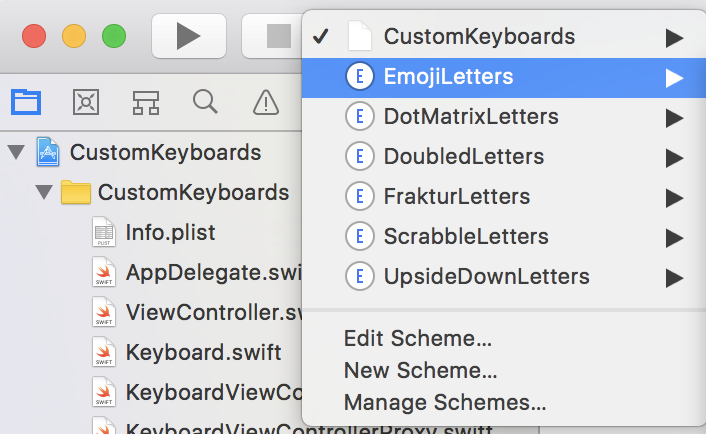

# Background

I'm a pretty silly person but sometimes being silly can be surprisingly hard! One of those times is being able to type out certain sequences of Unicode characters while tweeting or texting from within iOS.

iOS natively allows you through the settings app to add additional keyboards but they're primarily for exposing character sets for other languages.
Unlike OS X, there is no Characters utility in iOS for scrolling through code points and selecting characters. There _are_ apps in the App Store, such as [Unicode Pad](https://itunes.apple.com/us/app/unicode-pad/id374098312?mt=8), which let you search and select as well as maintain a scratch pad of sorts for keeping previous search results.

There are also numerous Web sites which allow you to "translate" regular text into upside down text. This becomes fairly cumbersome if you want to type out entire words of sentences using fraktur characters and not have to switch out of the app you're currently typing in. Hence, I decided to try to build my own custom iOS keyboards that could be brought up on demand from within an app.

It turns out that Apple provides a template for creating from within XCode, and [guidelines](https://developer.apple.com/library/content/documentation/General/Conceptual/ExtensibilityPG/CustomKeyboard.html) for creating one.
There _are_ indeed lots of tutorials out there on the Web for creating custom keyboards but 1) they all used screen metrics with values hardcoded to the portrait orientation and for a specific model of iPhone, and 2) they all used XIB files for layout and after some research it seemed like beyond a point it was much easier to layout component imperatively. And so I embarked on this project.

# Building and running

This app requires iOS 11.x and above because of its dependence on characters in the higher code points of Unicode, as well as XCode 9.x which comes bundled with runtimes for iOS 11.x.

First, checkout the project:

```
git clone https://github.com/quephird/CustomKeyboards
```

Next, select any of the keyboard targets:

<p align="center">
  
</p>

... and select whatever iOS runtime you have installed and click the black triangle to run the project.

To expose the keyboards, you'll have to do a couple of things. First, make sure to trust the app; in the Settings app, go to General -> Keyboard -> Keyboards -> Add New Keyboard...

<p align="center">
  
</p>

... and select whatever keyboards you want to install.

<p align="center">
  
</p>

# Features

Features that are currently implemented and functional:

* Lowercase and uppercase letters on all keyboards except emoji (because sadly there aren't enough emoji to match with all the lowercase letters)
* Space, backspace, and return keys
* Appropriate clicks when keys tapped

There are six keyboards at this time including:

#### Dot matrix letters

<p align="center">
  
</p>

#### Doubled letters

<p align="center">
  
</p>

#### Emoji

<p align="center">
  
</p>

#### Fraktur

<p align="center">
  
</p>

#### Scrabble tiles

<p align="center">
  
</p>

#### Upside down letters

<p align="center">
  
</p>

Features that are not supported yet:

* Holding down the globe key for the input list switcher view
* Holding down any of the keys to repeat their entry
* Visual cues when tapping keys (The system keyboard expands the size of the tapped key to a larger rounded rectangle)
* Ideally to get RTL working for the upside down keyboard

# Important links

App Extension Programming Guide for developing custom iOS keyboards  
[https://developer.apple.com/library/content/documentation/General/Conceptual/ExtensibilityPG/CustomKeyboard.html](https://developer.apple.com/library/content/documentation/General/Conceptual/ExtensibilityPG/CustomKeyboard.html)  

# License

Copyright (C) 2017, ⅅ₳ℕⅈⅇℒℒⅇ Ҝⅇℱℱoℜⅆ.

Distributed under the Eclipse Public License either version 1.0 or (at your option) any later version.
